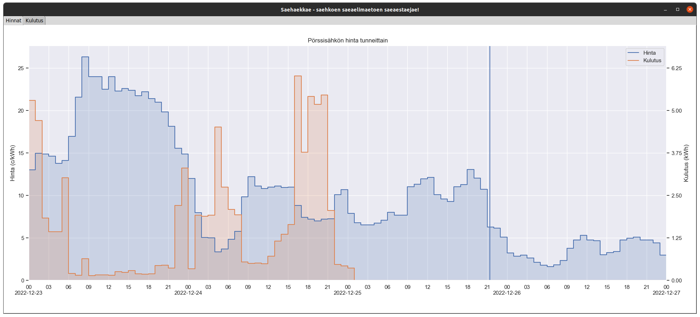

# Saehaekkae - saehkoen saeaelimaetoen saeaestaejae

Saehaekkae (lue: "sähäkkä") on ohjelma, jonka tarkoituksena on pienentää
käyttäjän sähkölaskua. Sovellus on Helsingin yliopiston ohjelmistotekniikan
harjoitustyö.

Tällä ohjelmalla voi säästää sähköä ja siten pienentää sähkölaskua. Venäjän
hyökkäyssota Ukrainaan on sotkenut sähkömarkkinat, ja näinä aikoina sähkön hinta
on kallista. Se on todella ikävää. Sähköä kuitenkin edelleen riittää ja sitä voi
Suomessa johonkin hintaan käyttää. Olemme siis kaikki asiat huomioon ottaen
suhteellisen onnekkaita: täällä ei ole sota.

Kaikki eivät ole yhtä onnekkaita. Ukrainassa on pulaa aivan kaikesta, eikä
sähköä saa välttämättä yhtään millään hinnalla. Myös kaikesta muusta on kova
puute. Talvi tulee olemaan hyytävän kylmä. Kärsijöinä ovat kaikista
haavoittuvimmat, joista kaikista eniten haluaisimme huolta pitää. Jos siis
onnistut tällä ohjelmalla säästämään sähköä, toivoisin että **lahjoitat ainakin
osan syntyvistä säästöistä Ukrainan tukemiseen**. Tässä on linkki lahjoituksen
tekemiseen:

<https://www.unicef.fi/tue-lapsia/lahjoita/lahjoita-ukrainan-lapsille>

## Toiminnallisuudet

- Sähkön hinnan sekä oman kulutuksen seurava graafisesta käyttöliittymästä
- Mahdollisuus ohjelmoida wifi-releitä halpaan sähkön hintaan tekstikäyttöliittymästä
- Mahdollisuus lähettää perheen kesken jaettuun kalenteriin hälytyksiä korkeasta
  tai matalasta sähkön hinnasta.
- Mahdollisuus laajentaa ohjelmaa yksinkertaisesti vastaamaan paremmin omia tarpeita

## Dokumentaatio

[Vaatimusmäärittely](dokumentaatio/vaatimusmaarittely.md)

[Arkkitehtuurikuvaus](dokumentaatio/arkkitehtuuri.md)

[Käyttöohje](dokumentaatio/kayttoohje.md)

[Testaus](dokumentaatio/testaus.md)

[Työaikakirjanpito](dokumentaatio/tuntikirjanpito.md)

[Release](https://github.com/ahojukka5/ot-harjoitustyo/releases/tag/0.1.0)

[Changelog](dokumentaatio/changelog.md)

## Asennus

Kattavampi ohjeistus asennuksesta löytyy
[käyttöohjeesta](dokumentaatio/kayttoohje.md). TLDR:

```bash
poetry install
poetry run invoke update
poetry run invoke start
```

`update`-komento päivittää tietokannan. `start`-komento käynnistää graafisen
käyttöliittymän, `start-tui` käynnistää tekstikäyttöliittymän. Ohjelmalla voi
lisätä kalenteriin muistutuksia sähkön hinnasta. Se edellyttää googlen
autentikointia, eikä ole erityisen helppoa. Ohjeet löytyvät käyttöohjeesta.
Autentikointi tehdään komennolla `poetry run invoke auth`.



## Komentorivitoiminnot

Testaus

```text
poetry run invoke test
```

Linting:

```text
poetry run invoke lint
```

Coverage-report

```text
poetry run invoke coverage-report
```
