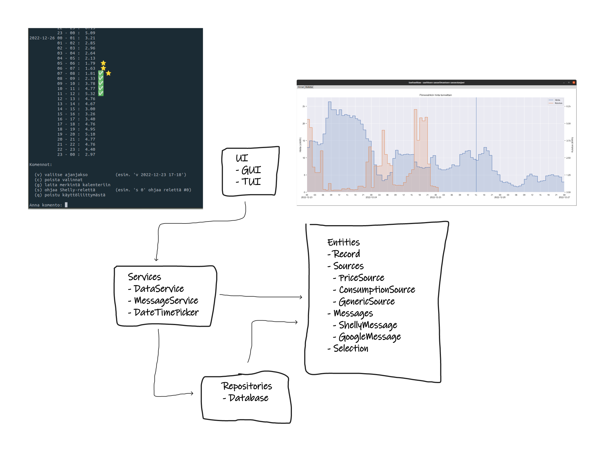
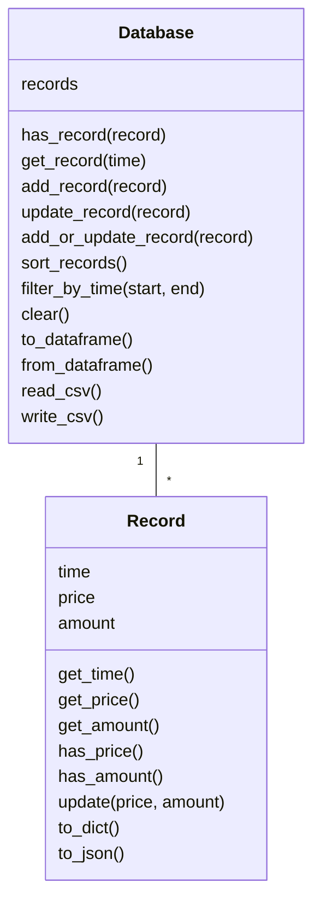
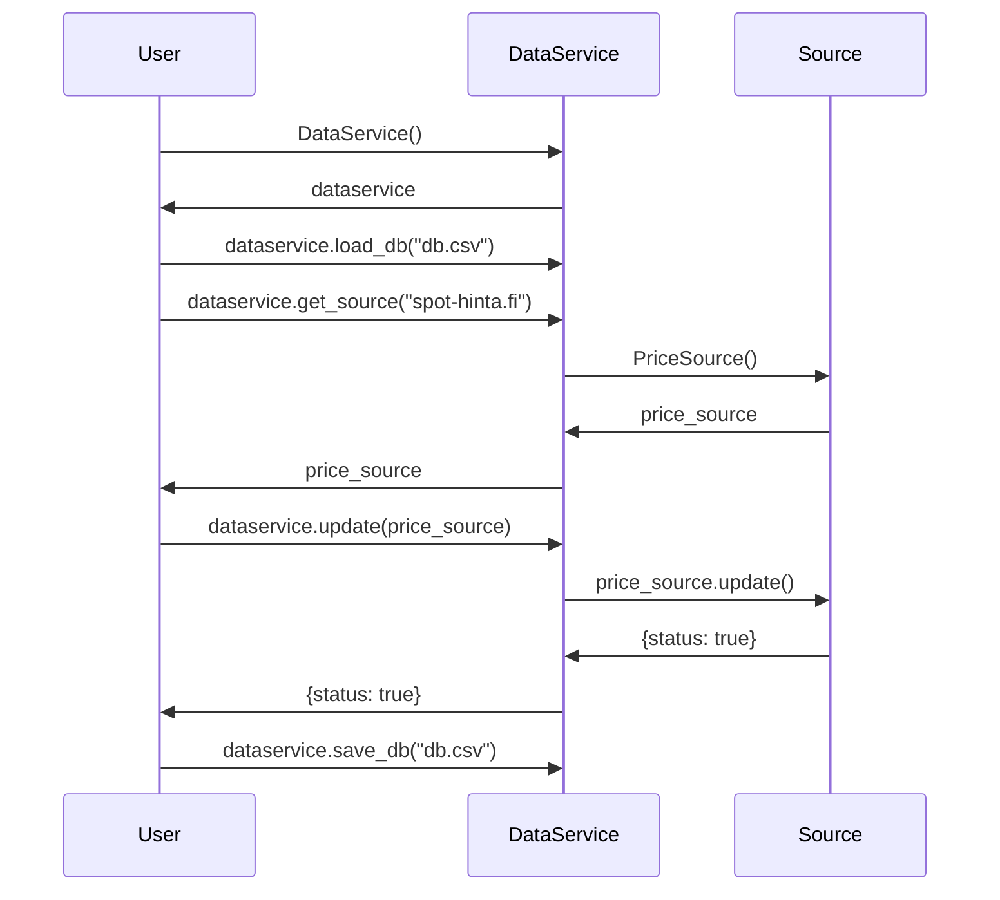
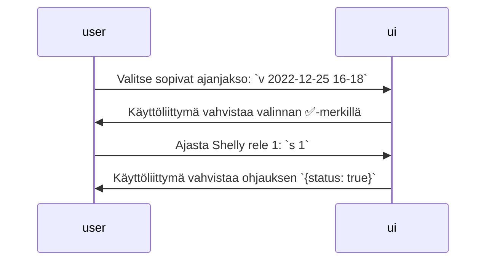

# Sovelluksen arkkitehtuuri

## Rakenne

Sovelluksen koodi on laitettu alihakemistoihin kerrosarkkitehtuurin
periaatteiden mukaisesti. Pakkausrakenne on seuraava:



## Käyttöliittymä

Käyttäjä ohjaa ohjelmaa tekstipohjaisesta tai graafisesta käyttöliittymästä. Graafisesta käyttöliittymästä voi tarkastella hintatietoja sekä omaa kulutusta. Tekstikäyttöliittymästä voi valita tiettyjä tunteja ja niiden pohjalta lähettää viestin. Tekstikäyttöliittymä voi aluksi tuntua omituiselta valinnalta, mutta se osoittautuu oikein hyväksi jos ohjauksia on tarkoitus tehdä headless-koneilta, erimerkiksi Raspberry Piltä.

Hintatiedot päivitetään automaattisesti kun sovellus käynnistetään. Pysyvien tietojen päivitys ja tallennus tulee tehdä erillisellä skriptillä.

## Sovelluslogiikka

Sovelluksen tietomallin muodostaa `Database`-luokka, joka sisältää
`Record`-entiteettejä. Jokaiseen entiteettiin sisältyy ajankohta, hinta, ja
kulutus. Ajankohta tarkoittaa alkavaa tuntia, esimerkiksi 2022-12-25 16:00
tarkoittaa käytännössä aikaväliä 2022-12-25 16:00 - 17:00.



Entiteeteistä `Record` sisältää hinta- ja kulutustietoja. Lähteet päivittävät
netistä tai tiedostosta hinta- ja kulutustietoja ja viestit vastaavat hinta- ja
kulutustietojen välittämisestä käyttäjälle eri tavoin.

`MessageService` ja `DataService` -luokat luovat viestejä ja lähteitä, jotka
yleensä kulutetaan saman tien. Viestien ja lähteiden luominen noudattelee
jossakin määrin geneeristä ohjelmointia sillä ne esitellään Service-luokkiin
string-dictionaryn kautta. Esimerkiksi tietokannan hintatietojen päivittäminen
menee seuraavasti:




Viestien lähettäminen menee hieman samalla tavalla. Esimerkiksi tietokannan
päivitys, kolmen halvimman tunnin etsiminen ja kalenterimerkinnän tekeminen
menisi seuraavasti:

```python
# update database
ds = DataService()
ds.load_db("db.csv")
source = ds.get_source("json", local_file="data/generic-data.json")
ds.update_db(source)
ds.save_db("db_backup.csv")

# send message
ms = MessageService()
selection = ds.find_cheapest_hours(hours=3, order="time")
message = ms.create_message(selection, target="google-calendar")
status = ms.send_message(
    message,
    credentials_file=config.GOOGLE_CREDENTIALS_FILE,
    calendar_id=config.GOOGLE_CALENDAR_ID,
)
```

## Tietojen pysyväistallennus

Ohjelma tallentaa ainoastaan hinta- ja kulutustietoja tietokantaan, joka on
csv-pohjainen. Sitä voi siis myös päivittää manuaalisesti tarvittaessa ja lukea
esimerkiksi Exceliin. Tietomäärä on niin pientä, että ascii-muotoinen
tallennustapa on yksinkertaisin tapa toteuttaa tiedon tallennus.

Tietokannan formaatti:

```
time,price,amount
2022-12-01T00:00:00+00:00,0.2845,0.2000
2022-12-01T01:00:00+00:00,0.2779,0.3000
2022-12-01T02:00:00+00:00,0.2682,nan
```

Eli header-row on `time,price,amount` jonka jälkeen tulee ISO8601-standardin
mukainen aikaleima, hinta euroina ja kulutus kilowattitunteina. Koska hintaa ja
kulutusta päivitetään eri lähteistä eri aikaan, kulutus on toisinaan
tuntematonta. Tuntematonta kulutusta tai hintaa merkitään `nan`. Aika on
UTC-aikaa. Periaatteessa voisi käyttää jotakin muutakin aikaa, mutta silloin
tulee ongelmia siirryttäessä kesäaikaan ja kesäajasta pois. Suosittelen
lämpimästä ajan tallennusta UTC-ajassa, kuin myös aikavyöhykkeen merkitsemistä.

## Päätoiminnallisuudet

Käyttäjä voi tarkastella sähkön hintaa ja omaa kulutusta graafisesta
käyttöliittymästä. Tulevissa versioissa käyttäjä voi myös valita kuvaajasta
ajanjakson ja valita minkälaisen viestin lähettää. Graafinen käyttöliittymä
käynnistetään komennolla `poetry run invoke start`.

Sen sijaan jo tänä päivänä voi käyttäjä valita ajanjaksoja ja lähettää viestejä
tekstikäyttöliittymästä yksinkertaisilla komennoilla. Tekstikäyttöliittymä
käynnistetään komennolla `poetry run invoke start-tui`. Esimerkiksi
Shelly-releen ohjelmointi:



## Muut toiminnallisuudet

Käyttäjällä tulee suurella varmuudella tarve kirjoittaa omia lähteitä ja
viestejä. Esimerkiksi eri sähköyhtiöt tuottavat kulutusdataa hieman eri
formaateissa. Tämä on otettu suunnittelussa huomioon. Näistä lisää
käyttöohjeessa.
