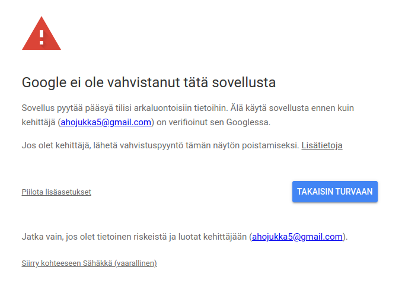

# Käyttöohje

Lataa ohjelman viimeisimmän releasen lähdekoodi
[GitHubista](https://github.com/ahojukka5/ot-harjoitustyo/releases).

Ohjelma käyttää poetryä, jolla voi asentaa kaikki riippuvuudet vaivattomasti.
Riippuvuudet asennetaan komennolla:

```bash
poetry install
```

## Konfigurointi

Ohjelma konfiguroidaan projektin hakemisossa olevalla `.env`-tiedostolla. Sellainen esimerkiksi on:

```python
# mitä lähdettä käytetään hintatietojen saamiseen
SAEHAEKKAE_ENERGY_PRICE_SOURCE = "spot-hinta.fi"
# mitä lähdettä käytetään kulutustietojen saamiseen
SAEHAEKKAE_ENERGY_CONSUMPTION_SOURCE = "json"
SAEHAEKKAE_ENERGY_CONSUMPTION_FILE = "data/generic-data.json"
# tietokannan nimi
SAEHAEKKAE_DB_FILE = "db.csv"
# Shellyn ip-osoite lähiverkossa
SAEHAEKKAE_SHELLY_IP = "192.168.1.30"
# google credentials -tiedosto
SAEHAEKKAE_GOOGLE_CREDENTIALS_FILE = "google_credentials.json"
# googlen kalenterin id-numero
SAEHAEKKAE_GOOGLE_CALENDAR_ID = "<63 merkkiä sotkua>@group.calendar.google.com"
```

`SAEHAEKKAE_ENERGY_CONSUMPTION_SOURCE` määrittää kuinka kulutustiedot saadaan. Minulla
itselläni kulutustiedot saa sähköyhtiön nettisivuilta export-nappulalla
Excel-taulukkoon, josta rakentelen erillisellä työkalulla json-tiedoston. Jos
haluat hoitaa asian vastaavanlaisesti, niin json-tiedoston muoto on

```bash
head -n 20 data/generic-data.json
```

```text
[
    {
        "time": "2022-12-21 22:00:00",
        "price": NaN,
        "amount": 2.09
    },
    {
        "time": "2022-12-21 23:00:00",
        "price": NaN,
        "amount": 0.96
    },
    {
        "time": "2022-12-22 00:00:00",
        "price": NaN,
        "amount": 1.12
    },
    {
        "time": "2022-12-22 01:00:00",
        "price": NaN,
        "amount": 3.55
```

Tällä samalla json-tiedostolla voi myös tuoda hintatiedot niin halutessaan.
Kulutustiedot voi myös hakea datahubista, josta ne saa csv-formaatissa. Sitä
varten on toinen source, `datahub`, eli sillä tavalla konfiguroitaessa olisi
esimerkiksi:

```text
ENERGY_CONSUMPTION_SOURCE = "datahub"
ENERGY_CONSUMPTION_FILE = "data/consumption.csv"
```

`SAEHAEKKAE_SHELLY_IP` on lähiverkossa olevan Shelly-releen ip-osoite, jos sellaista haluaa
ohjata. Jos `curl http://${SHELLY_IP}/rpc/GetStatus` palauttaa jotakin, olet
löytänyt oikean ip-osoitteen.

Sitten ne Google credentiaalit, joita tarvitaan jotta saadaan
kalenteri-integraatio toimimaan. **Tämä vaatii hieman viitseliäisyyttä**, ehkä
n. 5 minuutin verran. Ohjelma toimii ilmankin, mutta ilman Googlen
credentiaaleja kalenterimerkintöjen tekeminen ei onnistu. Perheen sisällä jaetun
kalenterin käyttö voi olla hyvä idea, sillä sillä tavalla voidaan tavoittaa
kaikki perheen sähkönkäyttäjät ja lähettää broadcast tyyppisesti viesti
esimerkiksi silloin, kun sähkön käyttöä tulisi vähentää.

Autentikaatioinformaation saaminen on kaksivaiheinen. Googlen oma
[dokumentaatio](https://developers.google.com/workspace/guides/create-credentials#oauth-client-id)
selittää asian todennäköisesti minua paremmin, joten kannattaa käyttää sitä
ensisijaisena lähteenä. Käytännössä ensin pitää Googlen Developer -konsolissa
tehdä uusi projekti ja luoda sille credentiaalit. Sieltä voi sitten ladata salaisuuksien tiedoston, joka on tämän tyyppinen:

```json
{
    "installed": {
        "client_id": "numeroita-ja-sotkua.apps.googleusercontent.com",
        "project_id": "saehaekkae",
        "auth_uri": "https://accounts.google.com/o/oauth2/auth",
        "token_uri": "https://oauth2.googleapis.com/token",
        "auth_provider_x509_cert_url": "https://www.googleapis.com/oauth2/v1/certs",
        "client_secret": "35 merkkiä sotkua",
        "redirect_uris": ["http://localhost"]
    }
}
```

Tämän jälkeen se varsinainen autentikointi tapahtuu nimeämällä tiedoston juureen
nimellä `client_secrets.json` ja ajamalla `poetry run invoke auth`. Avautuu
nettiselain, missä pitää antaa hyväksyntä kalenteriin kirjoittamiseen. Riippuen
kuinka olet projektin Googlen Developer -konsolissa luonut, dialogi
todennäköisesti myös ilmoittaa että ohjelmaa ei ole verifioitu ja olet tekemässä
vaarallisia asioista. Niistä pääsee ohi klikkaamalla dialogin vasemmassa
alareunassa olevaa pientä tekstiä.



Minuun ei tarvitse luottaa. Jos olet ise luonut ohjelman Googlen
Developer-konsolissa, viestissä näkyy sinun oma sähköpostiosoitteesi. Tämän
jälkeen autentikaatio tallentaa juureen tiedoston `google-credentials.json`,
joka on tämän tyyppinen:

```json
{
    "token": "210 merkkiä sotkua",
    "refresh_token": "103 merkkiä sotkua",
    "token_uri": "https://oauth2.googleapis.com/token",
    "client_id": "<45 merkkiä sotkua>.apps.googleusercontent.com",
    "client_secret": "35 merkkiä sotkua",
    "scopes": ["https://www.googleapis.com/auth/calendar"],
    "expiry": "2022-12-25T16:40:46.779442Z"
}
```

Lisäksi tarvitaan kalenteri-id. Oma ehdotukseni on, että yksi perheenjäsen luo
uuden kalenterin omavalintaisella nimellä ja jakaa sen perheen kesken.
Autentikoinnin jälkeen ohjelma printtaa kalenterien nimet ja id-numerot. Laita
id-numero `.env`-tiedoston `SAEHAEKKAE_GOOGLE_CALENDAR_ID`-muuttujaan. 

## Ohjelman käyttäminen

Ohjelman graafinen käyttöliittymä käynnistetään komennolla

```bash
poetry run invoke start
```

Valitettavasti aikataulu yllätti koodarin, eikä tällä kertaa voida tehdä muuta
kuin tarkastella sähkön kulutusta ja hintoja. Tarkoitus olisi, että käyttäjä
voisi hiirellä valita sopivan määrän tunteja ja antaa ohjausviestin, esimerkiksi
Shelly-releen ohjelmoinnin tai Googlen kalenterimerkinnän tekemisen. Nyt nämä
pitää tehdä tekstikäyttöliittymästä käsin. Tekstikäyttöliittymä käynnistetään
komennolla

```bash
poetry run invoke start-tui
```

Tekstikäyttöliittymä listaa tulevat pörssisähkön hinnat. Käyttö on
yksinkertaista. Ensin valitaan 1-N kappaletta ajanjaksoja komennolla `v pvm
klo_start-klo_end`, jonka jälkeen ohjataan relettä x komennolla `s x`.
Komennolla `g` voidaan laittaa Googleen kalenterimerkintä.

Käyttöliittymät päivittävät hintatiedot automaattisesti, mutta eivät tallenna
tuloksia. Tietokantojen tallentaminen tehdään eksplisiittisesti komennolla
`poetry run invoke update`.

## Skriptaaminen ja toiminnallisuuksien laajentaminen

Haluat kuitenkin. Ehkäpä sähköyhtiösi tarjoaa kulutustietoa jossakin eri
formaatissa. Yksi tapa on tehdä erillinen ohjelma, joka konvertoi datan
json-muotoon ja sen jälkeen käyttää `json`-lähdettä. Mikäli haluat kuitenkin
tiukemman integraation, voit tehdä oman luokan. Peri luokka
`AbstractSource`-luokasta ja implementoi `update`-funktio. Esimerkiksi
`spot-hinta.fi`:stä tehtävä tiedonhaku menee seuraavasti:

```python
from saehaekkae.entities import AbstractSource

class PriceSource(AbstractSource):
    """Update price data from spot-hinta.fi"""

    url = "https://api.spot-hinta.fi/TodayAndDayForward"

    def __init__(self, database):
        self._db = database
        self.price_updated = 0
        self.consumption_updated = 0

    def update(self):
        """Update price data."""
        response = requests.get(PriceSource.url, timeout=10)
        status_code = response.status_code
        if status_code != 200:
            warnings.warn("Unable to update prices from {url}: code {status_code}")
            return (self.price_updated, self.consumption_updated)
        rows = response.json()
        for row in rows:
            time = dateutil.parser.parse(row["DateTime"])
            price = row["PriceNoTax"]
            record = Record(time, price=price)
            price, amount = self._db.add_or_update_record(record)
            self.price_updated += price
            self.consumption_updated += amount
        return (self.price_updated, self.consumption_updated)
```

Eli konstruktoriin laitetaan ensimmäisenä argumenttina tietokanta, ja
tietokantaa päivitetään `add_or_update`-funktiolla. Palautuksena tulee montako
hintatietoa ja kulutustietoa on päivitetty.

Uusi lähde pitää rekisteröidä:

```python
from saehaekkae.service import DataService
ds = DataService()
ds.add_source("custom-source", CustomSource)
```

jonka jälkeen lähdettä voidaan käyttää:

```python
source = ds.create_source("custom-source")
ds.update_db(source)
```

Vastaavasti voidaan tehdä uusia viestejä, jotka peritään
`AbstractMessage`-luokasta ja joihin pitää implementoida `send`. Esimerkiksi
Google-kalenterimerkinnän tekeminen:

```python
class GoogleMessage(AbstractMessage):
    """GoogleMessage is a message with calendar event payload.

    This requires Google credentials file, and that is not the most trivial
    thing to get.

    Typical usage example:

    >>> selection = Selection()
    >>> selection.add_timerange("2022-12-24 18:00", "2022-12-24 19:00")
    >>> msg = GoogleMessage(selection, summary="Cheap energy, turn sauna on!")
    >>> credentials_file = "google_credentials.json"
    >>> calendar_id = "da...5eb@group.calendar.google.com"
    >>> msg.send(credentials_file, calendar_id)
    {"status": true}
    """

    def __init__(
        self, selection, timezone="Europe/Helsinki", summary="Sähköhälytys!", _io=None
    ):
        self._selection = selection
        self._timezone = timezone
        self._summary = summary
        self._payloads = self.create_payload()
        self._io = _io

    def get_payloads(self):
        """Return payloads."""
        return self._payloads

    def maybe_print(self, *args, **kwargs):
        """Print a message if io is connected."""
        if self._io:
            self._io.print(*args, **kwargs)

    def create_payload(self):
        """Create jsonable payload to send using Google service."""
        payloads = []
        for selection in self._selection:
            payloads.append(
                {
                    "summary": self._summary,
                    "start": {
                        "dateTime": selection.start.strftime("%Y-%m-%dT%H:%M:%S"),
                        "timeZone": self._timezone,
                    },
                    "end": {
                        "dateTime": selection.end.strftime("%Y-%m-%dT%H:%M:%S"),
                        "timeZone": self._timezone,
                    },
                    "reminders": {
                        "useDefault": False,
                        "overrides": [
                            {"method": "popup", "minutes": 5},
                        ],
                    },
                }
            )
        return payloads

    def __repr__(self):
        return json.dumps(self._payloads, indent=4)

    def send(self, credentials_file, calendar_id):
        """Send message using Google service. This requires Google credentials."""
        credentials = Credentials.from_authorized_user_file(credentials_file)
        service = build("calendar", "v3", credentials=credentials)
        for payload in self._payloads:
            self.maybe_print("google calendar payload:")
            self.maybe_print(json.dumps(payload, indent=4))
            event = service.events().insert(calendarId=calendar_id, body=payload)
            status = event.execute()
            self.maybe_print(f"response: {status}")
        return {"status": True}
```

Rekisteröinti:

```python
from saehaekkae.service import MessageService
ms = MessageService()
ms.add_target("custom-target", CustomTarget)
```

Periaatteessa on mahdollista tehdä täysin automaattinen skripti esimerkiksi
cronjobilla ajastettavaksi. Kannattaa käynnistää cronjob esim. klo 15, koska
sähköjen hintatieto päivittyy n. klo 14. Tällainen skripti voisi esimerkiksi olla

```python
from saehaekkae.services import DataService, MessageService

# update database
ds = DataService()
ds.load_db("db.csv")
p, a = ds.update_db(source="spot-hinta.fi")
print(f"Update data from spot-hinta.fi: {p}/{a} prices/consumptions updated!")
ds.save_db("db.csv")

# find three cheapest hours
selection = ds.find_cheapest_hours(hours=3, order="time")
print("3 cheapest oncoming hours:")
for i, r in enumerate(selection, start=1):
    start = r.start.astimezone()
    end = r.end.astimezone()
    record = ds.get_record(r.start)
    price = record.get_price() * 100.0
    print(f"{i}. between {start} and {end} (price {price:0.2f} c/kWh)")

ms = MessageService()
message = ms.create_message(selection, target="shelly", relays=[1])
print(f"message to shelly: {msg1}")
status = ms.send_message(message, shelly_ip="192.168.1.30")
print(f"message send status: {status}")
```

Mainittaakoon että ajastusten tekeminen esimerkiksi Home Assistantilla onnistuu
myös, mutta ne perustuvat hieman erilaiseen tekniikkaan. Home Assistant lähettää
wifi-verkossa päälle-komennon tiettyyn kellonaikaan, kun taas Sähäkkä lähettää
json-viestin joka ohjelmoi Shellyn omaa kellokytkintä. Toisin sanoen, jos
wifi-verkko kyykkää tai Shelly putoaa wifistä (mitä ne ovat varsin hyviä
tekemään), Home Assistantin ajatus ei toimi, mutta Sähäkällä tehty ajastus
toimii.

## Lopuksi

Sähkön säästäminen näinä aikoina on erittäin perusteltua. GitHubin oikeassa
yläkulmassa on mahdollisuus antaa projektille tähtiä. Jos oikeasti käytät tätä
ohjelmaa johonkin, klikkaa projektille yksi tähti lisää. Jos tulee tarpeeksi
tähtiä niin jatkan kehittämistä eteenpäin jotta saadaan helppokäyttöinen ohjelma
jolla sähkön säästäminen onnistuu vaivattomasti.

Jos onnistut tällä ohjelmalla säästämään sähköä, **pyytäisin että lahjoitat
ainakin osan syntyvistä säästöistä Ukrainan tukemiseen**. Tässä on linkki
lahjoituksen tekemiseen:
<https://www.unicef.fi/tue-lapsia/lahjoita/lahjoita-ukrainan-lapsille>.

