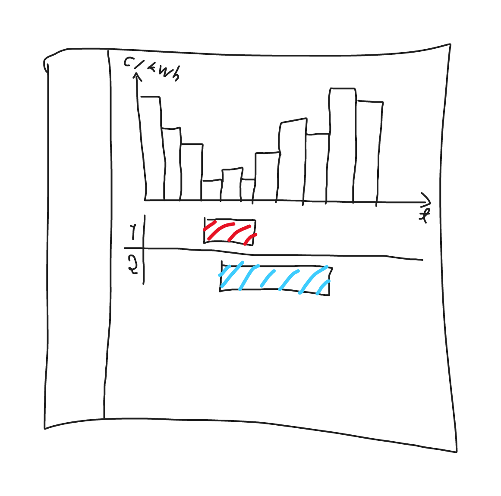

# Vaatimusmäärittely

## Taustatietoa

Pörssisähkö on sellainen sähkösopimuksen muoto, jossa sähkön hinta vaihtelee
tunnettein sähköpörssin markkinahinnan mukaan.

## Sovelluksen tarkoitus

**Sovelluksen tarkoitus on vähentää käyttäjänsä sähkölaskua**. Tämä tapahtuu
pääasiallisesti kahdella eri tavalla. Ensisijaisesti sovellus avustaa käyttäjää
siirtämään sähkönkulutusta halvoille tunneille joko muistutuksilla tai
laitteiden ohjauskomennoilla. Toissijaisesti käyttäjä voi tarkastella
jälkeenpäin historiallista sähkön kulutusta sekä hintatietoa sen toteamiseksi,
onko ohjaus onnistunut.

## Käyttäjät

Sovelluksessa on alustavasti kahdenlaista käyttäjäroolia: peruskäyttäjä ja
edistynyt käyttäjä. Peruskäyttäjä käyttää sovellusta yksinkertaisesta
graafisesta käyttöliittymästä. Toiminnallisuus on rajoitettua ja pääpaino on
käytön yksinkertaisuudessa. Edistynyt käyttäjä voi käyttää sovellusta
tekstikäyttöliittymästä ja tehdä monimutkaisempia ohjauksia. Tarkoitus ei ole
tehdä erillistä käyttäjän tunnistamista, vaan mahdolliset kehittyneet
ominaisuudet piilotetaan peruskäyttäjältä.

## Käyttöliittymäluonnos

Sovelluksessa on kaksi erillistä käyttöliittymää.

Tekstipohjaisella käyttöliittymällä sovellusta voidaan käyttää komentoriviltä,
mikä on tärkeää ajatellen erilaisia automatisointiratkaisuja. Tekstipohjaisen
käyttöliittymän perusajatus on muotoilla viesti, joka voidaan edelleen lähettää
eri tavoin. Tällainen viesti voi olla esimerkiksi ohjauskomento wifi-releelle
json-muodossa, sähköpostiviesti tai ajastettu push up -notifikaatio puhelimeen.

Tämän lisäksi toteutetaan graafinen käyttöliittymä, jonka **keskeinen päämäärä
on olla mahdollisimman yksinkertainen**. Periaate on: *kaksi nappulaa on liikaa,
jos yhdelläkin pärjää*.

Käyttöliittymässä näkyy sen hetkinen sähkön hinta. Käyttäjä voi klikata,
maalata, tai muulla vastaavalla hiirellä tapahtuvalla interaktiolla valita
"halvat tunnit" ja valita komennon. Komento voi olla esimerkiksi releen
ohjauskomento päälle haluttuna aikana tai ilmoitus puhelimeen (mikäli sopiva
yhdyskäytävä tällaiseen toiminnallisuuteen on mahdollista saada).

## Perusversion tarjoama toiminnallisuus

Perusversiossa käyttäjä voi valita graafisesta käyttöliittymästä tunnin tai
tunteja ja valita komennon. Komento voi esimerkiksi ohjelmoida wifi-releen
ajastuksen. Koska kaikilla ei tällaisia releitä ole, niin vaihtoehtoinen komento
on pyytää itselle kännykkään muistutus haluttuun ajanhetkeen, mikäli sellainen
on mahdollista ilmaiseksi toteuttaa. Kolmas vaihtoehto on ajastettu
sähköpostiviesti. Parhaassa tapauksessa käyttäjä voi käyttää kaikkia mainittuja
tapoja, esimerkiksi ohjata wifi-kellokytkimellä lämminvesivaraajan yöllä klo 3-5
päälle sekä pyytää kännykkään muistutuksen, kun on aika laittaa pyykinpesukone
päälle.

- [x] käyttäjä voi tarkastella kuluvan päivän ja seuraavan päivän sähkön hintoja
      graafisesti käyttöliittymästä

## Jatkokehitysideoita

- automatiikka, joka valitsee esimerkiksi kolme halvinta tuntia ja toteuttaa
  kellokytkimen ohjelmoinnin täysin itsenäisesti crontab-ohjattuna
- sähkön hintatietojen ja kulutustiedon tallennus tietokantaan
- näkymä, josta voi seurata oman sähkön käytön toteutumista, laskea sähkön
  keskihinnan, saada hienoja graafeja ja käppyröitä yms.
- tuuli-, lämpötila ym. ennusteet
- anonymisoidun käyttötiedon lähetys pelipalvelimelle, "sähkönsäästökilpailu"
- integroituminen johonkin toiseen järjestelmään, esim. Home Assistant
- selainpohjainen käyttöliittymä, asennus esim. Android-tablettiin koko ruudun
  tilaan
