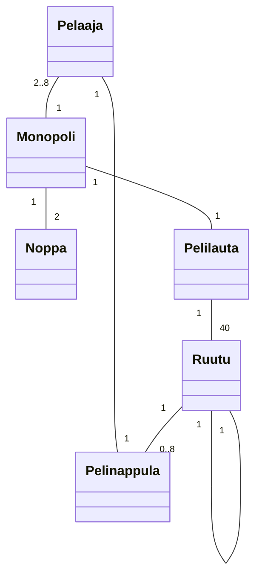

# Tehtävä 1: Monopoli

Luokat:

- Peli
- Pelilauta
- Pelaaja
- Ruutu
- Noppa
- Pelinappula

```mermaid
classDiagram
%% Monopolia pelataan käyttäen kahta noppaa.
Monopoli "1" -- "2" Noppa
%% Pelaajia on vähintään 2 ja enintään 8.
Pelaaja "2..8" -- "1" Monopoli
%% Peliä pelataan pelilaudalla joita on yksi.
Monopoli "1" -- "1" Pelilauta
%% Pelilauta sisältää 40 ruutua.
Pelilauta "1" -- "40" Ruutu
%% Kukin ruutu tietää, mikä on sitä seuraava ruutu pelilaudalla.
Ruutu "1" -- "1" Ruutu
%% Kullakin pelaajalla on yksi pelinappula.
Pelaaja "1" -- "1" Pelinappula
%% Pelinappula sijaitsee aina yhdessä ruudussa.
Ruutu "1" -- "0..8" Pelinappula
```
