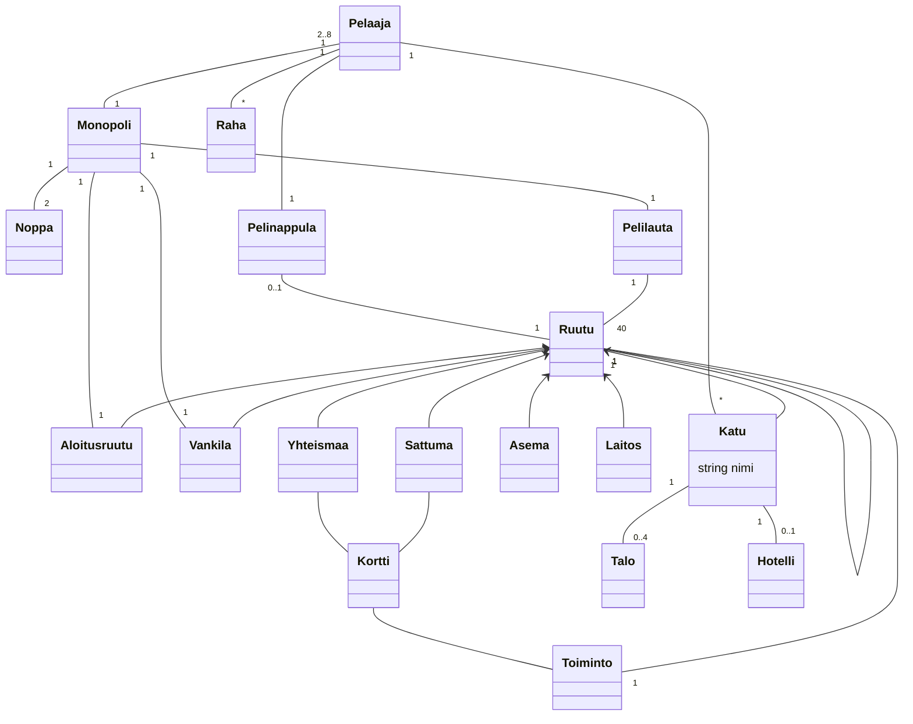

# Tehtävä 2: Laajennettu Monopoli

Luokat:

- Peli
- Pelilauta
- Pelaaja
- Ruutu
- Noppa
- Pelinappula

Lisäksi:

- Aloitusruutu
- Vankila
- Sattuma
- Yhteismaa
- Asema
- Laitos
- Katu
- Kortti
- Toiminto
- Hotelli
- Talo

