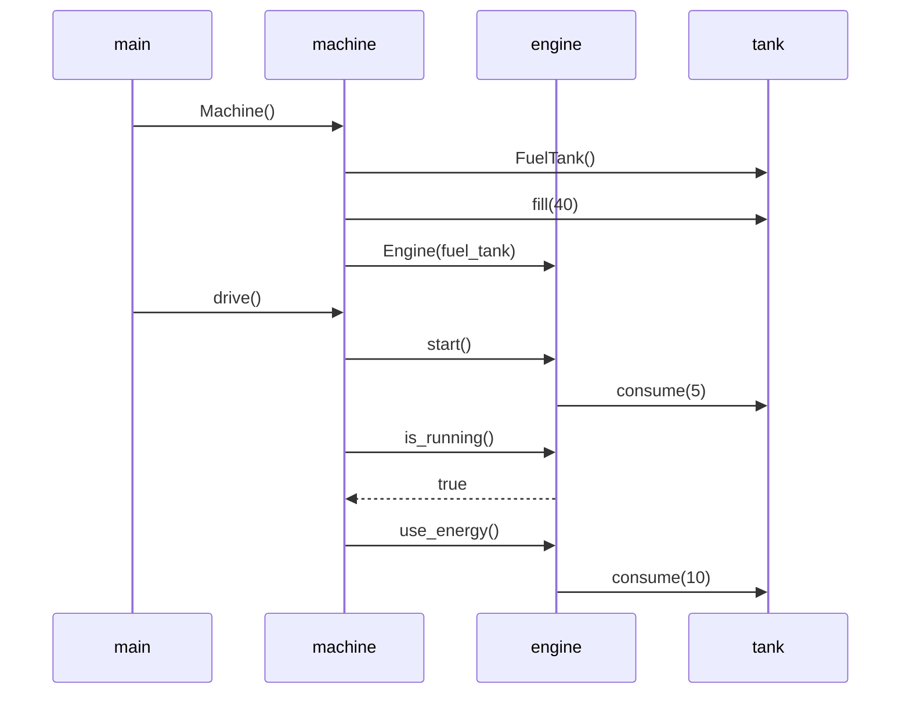

# Tehtävä 3: Sekvenssikaavio

Piirrä sekvenssikaaviona tilanne, jossa kutsutaan (jostain koodin ulkopuolella
olevasta metodista) ensin Machine-luokan konstruktoria ja sen jälkeen luodun
Machine-olion metodia drive.

```python
class Machine:
    def __init__(self):
        self._tank = FuelTank()
        self._tank.fill(40)
        self._engine = Engine(self._tank)

    def drive(self):
        self._engine.start()
        running = self._engine.is_running()

        if running:
          self._engine.use_energy()

class FuelTank:
    def __init__(self):
        self.fuel_contents = 0

    def fill(self, amount):
        self.fuel_contents = amount

    def consume(self, amount):
        self.fuel_contents = self.fuel_contents - amount

class Engine:
    def __init__(self, tank):
        self._fuel_tank = tank

    def start(self):
        self._fuel_tank.consume(5)

    def is_running(self):
        return self._fuel_tank.fuel_contents > 0

    def use_energy(self):
        self._fuel_tank.consume(10)
```


