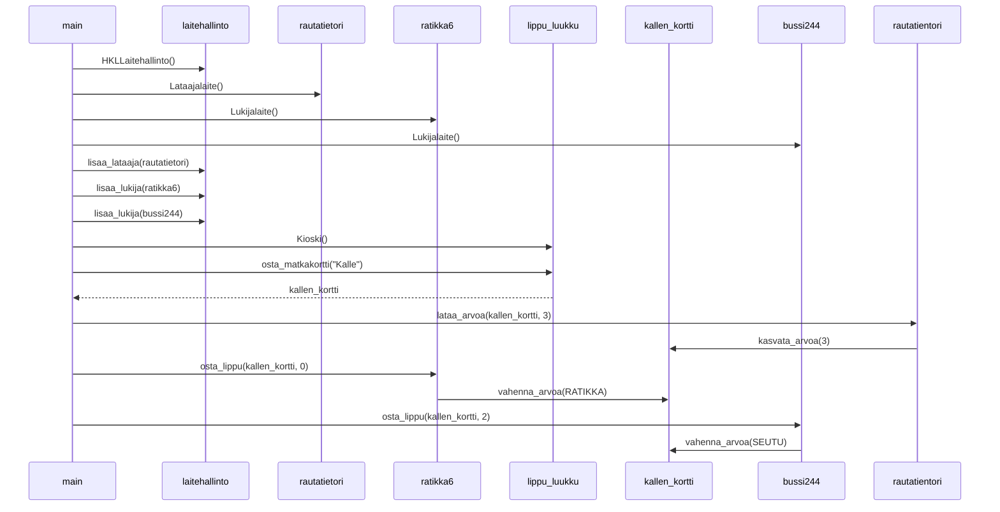

# Tehtävä 4: Laajempi sekvenssikaavio

Tarkastellaan HSL-matkakorttien hallintaan käytettävää koodia.

Kuvaa sekvenssikaaviona koodin main-funktion suorituksen aikaansaama
toiminnallisuus.

Muista, että sekvenssikaaviossa tulee tulla ilmi kaikki mainin suorituksen
aikaansaamat olioiden luomiset ja metodien kutsut!

```python
class Kioski:
    def osta_matkakortti(self, nimi, arvo = None):
        uusi_kortti = Matkakortti(nimi)

        if arvo:
            uusi_kortti.kasvata_arvoa(arvo)

        return uusi_kortti

class Matkakortti:
    def __init__(self, omistaja):
        self.omistaja = omistaja
        self.pvm = 0
        self.kk = 0
        self.arvo = 0

    def kasvata_arvoa(self, maara):
        self.arvo += maara

    def vahenna_arvoa(self, maara):
        self.arvo -= maara

    def uusi_aika(self, pvm, kk):
        self.pvm = pvm
        self.kk = kk

class Lataajalaite:
    def lataa_arvoa(self, kortti, maara):
        kortti.kasvata_arvoa(maara)

    def lataa_aikaa(self, kortti, pvm, kk):
        kortti.uusi_aika(pvm, kk)

RATIKKA = 1.5
HKL = 2.1
SEUTU = 3.5

class Lukijalaite:
    def osta_lippu(self, kortti, tyyppi):
        hinta = 0

        if tyyppi == 0:
            hinta = RATIKKA
        elif tyyppi == 1:
            hinta = HKL
        else:
            hinta = SEUTU

        if kortti.arvo < hinta:
            return False

        kortti.vahenna_arvoa(hinta)

        return True

class HKLLaitehallinto:
    def __init__(self):
        self._lataajat = []
        self._lukijat = []

    def lisaa_lataaja(self, lataaja):
        self._lataajat.append(lataaja)

    def lisaa_lukija(self, lukija):
        self._lukijat.append(lukija)

def main():
    laitehallinto = HKLLaitehallinto()

    rautatietori = Lataajalaite()
    ratikka6 = Lukijalaite()
    bussi244 = Lukijalaite()

    laitehallinto.lisaa_lataaja(rautatietori)
    laitehallinto.lisaa_lukija(ratikka6)
    laitehallinto.lisaa_lukija(bussi244)

    lippu_luukku = Kioski()
    kallen_kortti = lippu_luukku.osta_matkakortti("Kalle")

    rautatietori.lataa_arvoa(kallen_kortti, 3)

    ratikka6.osta_lippu(kallen_kortti, 0)
    bussi244.osta_lippu(kallen_kortti, 2)

if __name__ == "__main__":
    main()
```


